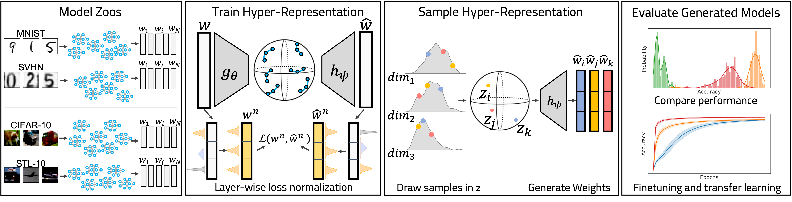

Hyper-Representations as Generative Models: Sampling Unseen Neural Network Weights
=============================================


    Code to reproduce the results from NeurIPS 2022 paper "Hyper-Representations as Generative Models: Sampling Unseen Neural Network Weights".





This repository contains code to reproduce the experiments from NeurIPS 2022 paper **"Hyper-Representations as Generative Models: Sampling Unseen Neural Network Weights"**. The paper can be found here: [NeurIPS website](https://proceedings.neurips.cc/paper_files/paper/2022/hash/b2c4b7d34b3d96b9dc12f7bce424b7ae-Abstract-Conference.html) or [arxiv](https://arxiv.org/abs/2209.14733).


Paper Abstract
====
Learning representations of neural network weights given a model zoo is an emerging and challenging area with many potential applications from model inspection, to neural architecture search or knowledge distillation. Recently, an autoencoder trained on a model zoo was able to learn a hyper-representation, which captures intrinsic and extrinsic properties of the models in the zoo. In this work, we extend hyper-representations for generative use to sample new model weights. We propose layer-wise loss normalization which we demonstrate is key to generate high-performing models and several sampling methods based on the topology of hyper-representations. The models generated using our methods are diverse, performant and capable to outperform strong baselines as evaluated on several downstream tasks: initialization, ensemble sampling and transfer learning. Our results indicate the potential of knowledge aggregation from model zoos to new models via hyper-representations thereby paving the avenue for novel research directions. 


Reproducing Experiments
====
This repository contains code to reproduce the experiments in the paper. The package to train and sample hyper-representations can be installed with `pip3 install -e .`. It contains three modules:  
- `checkpoints_to_datasets` contains dataset classes for neural network models, as well as data preprocessing and augmentation  
- `model_definitions` contains the class definitions for all neural network architectures and trainers  
- `sampling_auxiliaries` contains the functions to sample hyper-representations, finetune and evaluate the generated populations  
  
Jupyter notebook examples to load pre-trained hyper-representations, train new hyper-representations or sample models are provided in `examples`.  
To download the pretrained hyper-representations and training data data go to `data` and run `bash download_data.sh`.


Get in touch!
====
If there are any questions, reach out to us! We'll respond to issues here, or via email `konstantin.schuerholt@unisg.ch`. 

Citation
====
If you want to cite this work, please use 
```
@inproceedings{schurholtHyperRepresentationsGenerativeModels2022,
  title = {Hyper-Representations as Generative Models: Sampling Unseen Neural Network Weights},
  booktitle = {Thirty-Sixth Conference on Neural Information Processing Systems (NeurIPS)},
  author = {Sch{\"u}rholt, Konstantin and Knyazev, Boris and Gir{\'o}-i-Nieto, Xavier and Borth, Damian},
  year = {2022},
  month = sep,
}
```

Note
====

This project has been set up using PyScaffold 4.3.1. For details and usage
information on PyScaffold see https://pyscaffold.org/.
